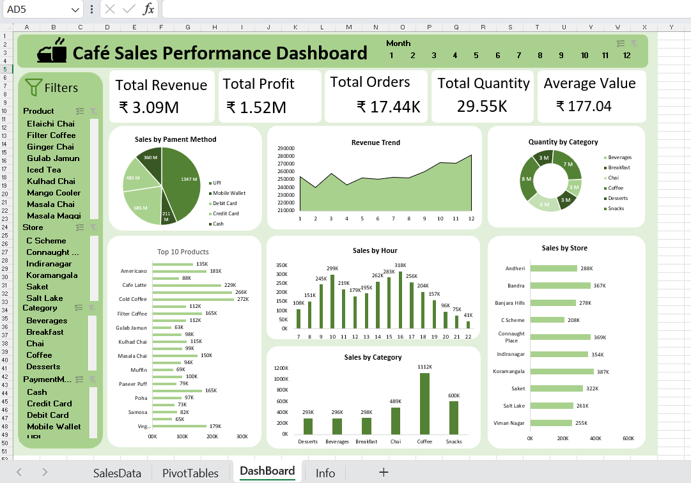

# ☕ Café Sales Performance Dashboard

## 📊 Excel Data Analytics Project

An interactive **Café Sales Performance Dashboard** created using Microsoft Excel and Power Query to analyze sales performance, revenue, products, categories, transactions, payment methods, and customer purchasing patterns.

---

## 🎯 Project Objective

The objective of this project is to transform raw café sales data into an interactive dashboard that provides a quick and clear overview of business performance.

The dashboard helps analyze:

- Total sales revenue
- Total transactions
- Quantity sold
- Product performance
- Category-wise sales
- Payment method analysis
- Sales by day
- Sales by month
- Sales by hour
- Customer purchasing patterns

---

## 🛠️ Tools & Technologies

- Microsoft Excel
- Power Query
- PivotTables
- PivotCharts
- Slicers
- Excel Formulas
- Data Cleaning
- Data Transformation
- Data Analysis
- Data Visualization
- Dashboard Design

---

## 🔄 Data Preparation

The raw café sales data was prepared using **Power Query**.

The data preparation process included:

1. Importing the raw sales dataset.
2. Cleaning and transforming the data.
3. Handling date and time fields.
4. Creating useful analytical columns.
5. Checking data consistency.
6. Preparing the dataset for PivotTables and dashboard analysis.

---

## 📌 Key Performance Indicators

| KPI | Value |
|---|---:|
| Total Revenue | — |
| Total Transactions | — |
| Total Quantity Sold | — |
| Average Transaction Value | — |
| Top-Selling Product | — |

> KPI values represent the current dashboard/filter state.

---

## 📈 Dashboard Features

### ☕ Sales Overview

Provides an overall view of café sales performance using key performance indicators.

### 💰 Revenue Analysis

Analyzes total revenue and identifies periods and products contributing the most to sales.

### 📦 Product Analysis

Compares products based on sales performance and identifies top-performing products.

### 🏷️ Category Analysis

Analyzes sales across different product categories.

### 💳 Payment Method Analysis

Shows how customers pay for their purchases and compares different payment methods.

### 📅 Monthly Analysis

Analyzes sales trends across different months to identify high and low-performing periods.

### 📆 Daily Analysis

Compares sales performance across different days of the week.

### ⏰ Hourly Analysis

Identifies peak sales hours and helps understand customer purchasing patterns throughout the day.

### 🎛️ Interactive Filters

Slicers allow users to interactively filter the dashboard and analyze specific periods, products, categories, and other dimensions.

---

## 🔍 Key Insights

Based on the dashboard analysis:

- The dashboard provides an overview of café sales performance.
- Sales performance can be analyzed by product and category.
- Monthly analysis helps identify changes in sales activity.
- Hourly analysis helps identify peak customer purchasing periods.
- Product-level analysis helps identify the best-performing products.
- Payment-method analysis provides insight into customer payment preferences.
- Interactive slicers allow users to explore different segments of the sales data.

---

## 📊 Dashboard Preview

---

## 💡 Business Recommendations

Based on the dashboard analysis:

1. Focus on high-performing products to maximize revenue.
2. Monitor peak sales hours to improve staff and resource planning.
3. Maintain sufficient inventory for popular products.
4. Analyze low-performing products and consider promotional strategies.
5. Monitor monthly sales trends for better business planning.
6. Use customer purchasing patterns to improve product and marketing strategies.
7. Track payment-method preferences to improve the customer payment experience.

👤 Author
Noman Akhtar
Data Analytics | Excel | SQL | Power Query | Power BI |Python | Data Visualization
